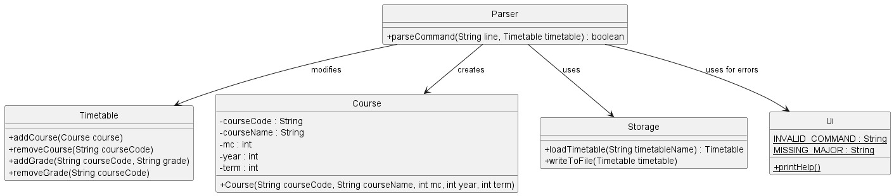

# Developer Guide

## Acknowledgements

{list here sources of all reused/adapted ideas, code, documentation, and third-party libraries -- include links to the original source as well}

## Design & implementation

### Parser component
The Parser is essential to interpreting user commands and executing appropriate actions on the timetable. 
This includes command parsing; breaking down user inputs into commands and parameters that PlaNUS can understand and
act upon.

Parser interacts with the following classes.
- 'Course': Creates Courses based on user input
- 'Timetable': Modifies timetable based on user input
- 'Storage': Uses Storage to save user data
- 'UI': Uses Ui to display error messages

Below is the class diagram:

 

### Timetable plan component
In order to keep track of the timetable plan of the user, 3 classes are used mainly.
- `Course`: Represents a course taken or planned by the user
- `Timetable`: Stores the list of courses
- `PlanGetter`: Provides access to the timetable plan

Below is the class diagram to illustrate this:

 

When `addCourse()` is called, it finds the suitable position to insert the newly added course according to the 
year and term. Then, the new course will be added into the list of courses.

Below is the sequence diagram to illustrate the implementation:

 

When `removeCourse()` is called, it attempts to find the course with the given course code and removes the course 
from the list of courses if it exists.

Below is the sequence diagram to illustrate the implementation:

 

There are 3 overloaded variations of the `getPlan()` method in the `PlanGetter` class.
The first is as shown in the class diagram above. 
The second takes in an additional integer `year`, while the third takes in two additional integers `year` and `term`.

Each of them loops through the timetable, getting the details of the courses in the course list.
The first variation outputs the details of all the courses in the plan, 
while the second and the third only pick out the specified year or term.

 

### Storage component
In order to store user data and load different data files for course planning, 
PlaNUS uses Storage class for this purpose.

Storage has two main file access APIs:
- `writeToFile(Timetable)`:
  - Take in a timetable containing courses, then write courses to the user data file at __./data/myTimetable.csv__.
    - Params: timetable – A table containing all courses of the user.
- `Timetable loadTimetable(String)`:
  - Take in a file name, then load the file containing all courses of the major/user to a Timetable object.
    - Params: timetableName – The name of the file containing all courses of the major/user. e.g. timetableName of "CEG" indicating the recommended timetable of Computer Engineering, while timetableName of "myTimetable" indicating the timetable of the user.
    - Returns: A timetable object that is loaded from the given file.

If target file is not found, the above two methods will be able to create the missing file.

Storage also contains a useful parser method `parseCourse(String)` that can parse a line of csv file into a Course object.

Below is a sequence diagram that shows how Storage takes part in the programme.

### Grade component
In order to store and check the grades of courses of the user, 4 classes are used mainly.
- `Grade`: Represents a grade of a course
- `Course`: Represents a course taken or planned by the user with grades being specified
- `Timetable`: Stores the list of courses
- `GradeChecker`: Provides access to the grades of the given period

Below is the class diagram to illustrate this:

 

When `addGrade()` is called, it finds the course according to the course code. Then, the grade will be set to that course.

Below is the sequence diagram to illustrate the implementation:

 

When `removeGrade()` is called, it finds the course according to the course code. Then, the `lettergrade` of that course is set to `null`.

Below is the sequence diagram to illustrate the implementation:

The grades keyed in by the user are **String** type, e.g.`"A"`.
In the `Grade` class, the `setNumberGrade()` method converts the grade into **double** type, which is more appropriate for the calculation of GPA and total grades.

There are 3 overloaded variations of the `checkGrade()` method in the `GradeChecker` class.
The first only takes in Timetable `timetable`, which records the current plan of the user.
The second takes in an additional integer `year`, while the third takes in two additional integers `year` and `term`.

### Ui Component
The Ui class is implemented with static methods to facilitate easy access to user interface functionalities without 
needing to instantiate the class. It manages a variety of messages that inform the user about the outcome of their commands, guide them on the correct command syntax, and display error messages for incorrect inputs.

**Key Methods and Their Design Choices:**

- `printLogo()`: Displays the PlaNUS logo at startup. This method enhances brand recognition and provides a welcoming 
user interface.

- `printHelp()`: Lists all available commands and their syntax. This method is crucial for aiding new users in 
familiarizing themselves with the application's functionalities.

- `printErrorMessage(String message)`: Accepts a string parameter and displays it as an error message. This method 
is designed to provide specific feedback on what went wrong, enhancing the user's ability to correct errors.

- `getUserCommand()`: Reads the user's input command. Implemented using a Scanner object, this method bridges the user 
command input with the application's processing logic.

#### Integration with Other Components

The Ui component works closely with the `Parser`, `Storage`, and various command classes. It acts as the output medium 
for messages generated by these components and reads input that is subsequently parsed and acted upon.

*   **Parser Component**: The Ui displays help and error messages based on parsing results.

*   **Storage Component**: Notifications about file operations (e.g., file creation success or failure) are relayed to 
the user via the Ui.

 

## Product scope
### Target user profile

Our target user profile is engineering students studying in NUS.

### Value proposition

The app aims to serve as a centralized platform for our target user to manage their past, current, and future courses 
based on their grades and interests. The app is able to keep a record of the user’s existing academic record and 
give the user relevant course information and future course recommendations.

## User Stories

| Version | As a ...                           | I want to ...                                                      | So that I can ...                                      |
|---------|------------------------------------|--------------------------------------------------------------------|--------------------------------------------------------|
| v1.0    | new user                           | see usage instructions                                             | refer to them when I forget how to use the application |
| v1.0    | new user                           | initialise my course plan based on my major's recommended schedule | populate the plan easily                               |
| v1.0    | user                               | have my data auto-saved                                            | not worry about saving them                            |
| v1.0    | user planning for future semesters | add new courses to the plan                                        | update the records                                     |
| v1.0    | user planning for future semesters | remove courses from the plan                                       | change my mind                                         |
| v1.0    | user planning for future semesters | view my course plan                                                | recall my plans                                        |
| v1.0    | user recording past grades         | add my grades                                                      | keep track of my latest results                        |
| v1.0    | user recording past grades         | modify my grades                                                   | keep track of my correct results                       |
| v1.0    | user recording past grades         | check my grades along with the GPA calculated                      | see my results easily                                  |
| v2.0    | user recording past grades         | check my grades with GPA calculated after SU declarations          | see my results and GPA easily                          |
| v2.0    | user planning for future semesters | move courses around semesters                                      | change my mind                                         |
| v2.0    | user pursuing UEs                  | add the course without knowing the exact course name               | have ease of use                                       |

## Non-Functional Requirements

{Give non-functional requirements}

## Glossary

* *glossary item* - Definition

## Instructions for manual testing

{Give instructions on how to do a manual product testing e.g., how to load sample data to be used for testing}
